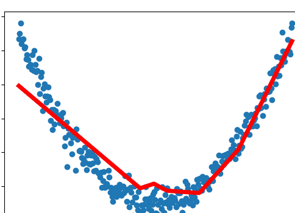

TensorFlow机器学习应用
-----------------------

1. 首先获得数据源

        x_data = np.linspace(-1, 1, 300)[:, np.newaxis]  # 制造300 个（-1，1 的点）
        
        nosie = np.random.normal(0, 0.05, x_data.shape) # 制造数据噪声，获得分散点
        
        y_data = np.square(x_data) - 0.5 + nosie  # 求平方
  
2. 创建神经层构造函数
    
        def add_layer(inputs, insize, outsize, n_layer,activation_function): # 定义神经层输入输出维度以及激励函数
        
            layer_name = 'layers%s' % n_layer
            
            with tf.name_scope(layer_name):
            
                with tf.name_scope('weights'):
                
                    Weights= tf.Variable(tf.random_normal([insize,outsize]))  # 定义初始权重为随机值矩阵
                    
                    tf.summary.histogram(layer_name+'/weights', Weights)  # 这里只是做数据流记录
                    
                with tf.name_scope('biases'):
                
                    biasis = tf.Variable(tf.zeros([1, outsize]) + 0.1)  # 定义偏置量，初始偏置矩阵为全部0 ，每次迭代基础上增加0.1
                    tf.summary.histogram(layer_name+'/biases', biasis)
                    
                with tf.name_scope('Wx_plus_b'):

                    Wx_plus_b = tf.matmul(inputs, Weights) + biasis  # 权重乘以输入变量 加上偏置量 以加快逼近
                    
                if activation_function is None:         # 若没有输出函数，则证明还不需要继续进入神经层迭代 输出结果
                    outputs = Wx_plus_b
                else:
                
                    outputs = activation_function(Wx_plus_b)   # 若有定义输出函数，则根据输出函数处理数据，继续迭代
                    tf.summary.histogram(layer_name+'/output', outputs)
                    
                return outputs
                
2. 创建两层网络结构

        lay1 = add_layer(xs, 1, 10, n_layer=1, activation_function=tf.nn.relu) # 这里的relu为一种线性激励函数
        
        prediction = add_layer(lay1, 10, 1, n_layer=2, activation_function=None) # 输出层定义
        
3. 定义损失函数

        loss = tf.reduce_mean(tf.reduce_sum(tf.square(ys - prediction),
        
                          reduction_indices=[1]))# 检测方差 reduce_mean  求平均值
                          
4. 开始训练
                      
       train_step = tf.train.GradientDescentOptimizer(0.1).minimize(loss) 
       
       # 训练算法为梯度下降算法，学习速率初始值为0.1 ，根据损失函数值动态调整
       
5. 初始化所有程序所需变量，开始迭代并画图

        init = tf.initialize_all_variables()
        with tf.Session() as sess:
        
            merged = tf.summary.merge_all()
            writer = tf.summary.FileWriter('sum', sess.graph)
            
            sess.run(init)
            fig = plt.figure()
            ax = fig.add_subplot(1, 1, 1)
            
            ax.scatter(x_data, y_data)
            plt.ion()  # show 的时候不暂停
            plt.show()
            for i in range(1000):
                sess.run(train_step, feed_dict={xs: x_data, ys: y_data}) # 输入随机生成的数据点
                if i % 50: 
                    print(sess.run(loss, feed_dict={xs: x_data, ys: y_data}))
                    result = sess.run(merged,feed_dict={xs: x_data, ys: y_data})
                    writer.add_summary(result,i)
                    try:
                        ax.lines.remove(lines[0])
                    except Exception:
                        pass
                    prediction_value = sess.run(prediction, feed_dict={xs:x_data})
                    lines = ax.plot(x_data,prediction_value, 'r-', lw=5)
                    plt.pause(0.01)
6. 结果图片如下

